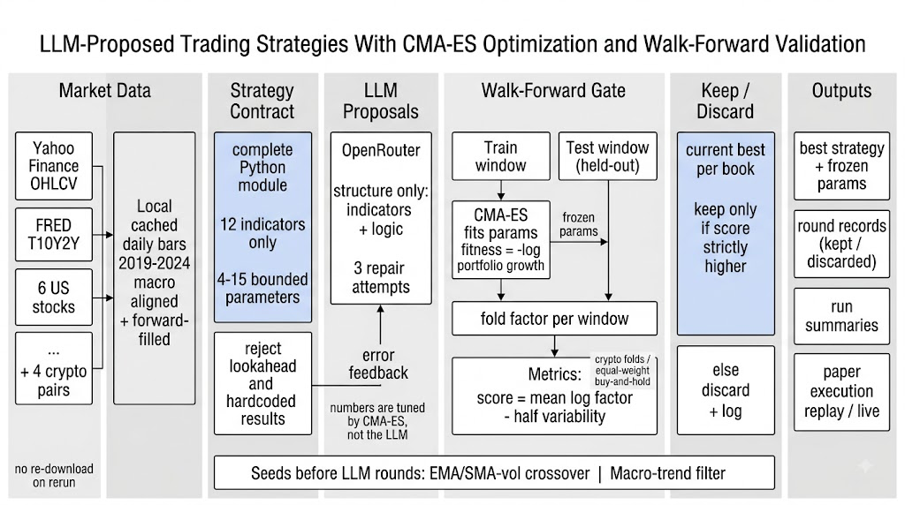

# LLM-Proposed Trading Strategies With CMA-ES Optimization and Walk-Forward Validation

This project implements an autonomous strategy-research loop in which a language model proposes complete trading strategies, a CMA-ES optimizer tunes their parameters, and walk-forward validation scores each proposal against held-out market history. The loop runs independently over two books on free daily data from 2019 through 2024: an equity book holding AAPL, MSFT, GOOGL, AMZN, NVDA, and AMD on the exchange-trading-day calendar, and a crypto book holding BTC-USD, ETH-USD, ADA-USD, and XRP-USD on a 24/7 calendar. The 10Y-2Y Treasury spread series is aligned and carried forward onto each book's calendar so every candidate trades against the same economic backdrop.

Every candidate is a complete module that declares a bounded set of tunable parameters and a position rule over the available price, volume, and macro series. Before a single real data point is touched, each module is parsed and rejected if it violates the fixed interface, misuses the allowed indicator set, or could depend on information not yet available at the time a position is taken — the no-lookahead property is verified mechanically rather than trusted from the model, so a strategy that peeks into the future is thrown out instead of silently scored. Rejected proposals are returned to the model with the exact failure, and refinement is capped at three attempts per round.

Evaluation is walk-forward over rolling training and held-out test windows. On each training window, CMA-ES searches the candidate's parameter space to maximize the compounded growth of the portfolio the strategy implies; the fitted parameters are then frozen and applied to the following held-out window to produce a per-window growth factor. A candidate's overall score is the average log factor across windows, penalized when results vary sharply from window to window. Positions across the book's tickers are combined by inverse-volatility weighting and rebalanced periodically, with turnover recorded. The crypto book divides each window's factor by the equal-weight buy-and-hold benchmark over the same window, so crypto strategies must beat passive drift; the equity book is scored on raw return against the cash alternative.

The comparison isolates the language model's contribution. Each run is seeded with hand-written baseline strategies calibrated through the exact evaluation path used for generated candidates, so both share the same validation, indicator library, portfolio construction, optimizer, fold schedule, and scoring. The model then proposes replacement strategies, and a candidate is kept only when it scores strictly higher than the current best. The run therefore measures whether structure chosen by the model — which indicators, which entry and exit rules, which parameters to expose — improves on structure written by hand once every other component is identical.

The best strategy per book, frozen with the parameters fitted on its final evaluation window, is written out in full and replayed bar by bar against fresh market data for paper execution, using the same evaluation components as the research loop.
